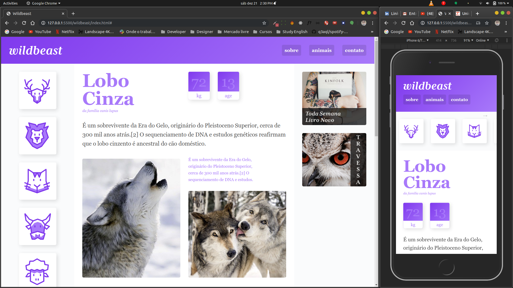

<h1 align="center">
   
  
   
   
  Wildbeast
</h1>

Making in the course Origamind - Using Grid Layout.

  

## Features

[//]: # "Add the features of your project here:"

- 💹 **Node Js** — A web framework for Node Js

## Getting started

- First make download to install all dependencies;
- In terminal use 'npm run dev' or 'yarn dev'.

## License

This project is licensed under the MIT License - see the [LICENSE](https://opensource.org/licenses/MIT) page for details.
